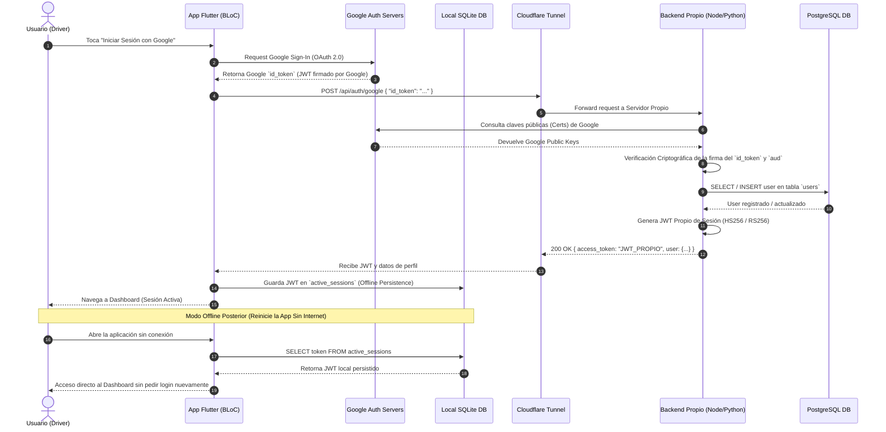

# 📐 Arquitectura de Software: Bitácora Stepway Fleet Manager

## 1. Resumen Ejecutivo
El sistema **Bitácora Stepway Fleet Manager** está diseñado bajo los principios de **Clean Architecture** (Arquitectura Limpia) y el patrón **BLoC (Business Logic Component)** en Flutter. La aplicación garantiza una estrategia **Offline-First**, permitiendo a los usuarios registrar mantenimientos, consultar métricas del vehículo (kilometraje, nivel de combustible, alertas de salud) sin depender de conectividad a internet inmediata, sincronizando los datos con la API REST nativa cuando la red esté disponible.

---

## 2. Diagrama de Componentes Macro (Mermaid)

```mermaid
graph TD
    subgraph Presentation Layer [Presentation Layer (Flutter UI & BLoC)]
        DashboardPage["DashboardPage (View)"]
        Components["Components (HeaderCard, StatMetricCard, PriorityServiceCard, HealthCard)"]
        MantenimientoBloc["MantenimientoBloc"]
        AuthBloc["AuthBloc (Session State)"]
    end

    subgraph Domain Layer [Domain Layer (Core Business Rules)]
        GetDashboardDataUseCase["GetDashboardDataUseCase"]
        IniciarSesionConGoogleUseCase["IniciarSesionConGoogleUseCase"]
        VehiculoEntity["Vehiculo (Entity)"]
        MantenimientoEntity["Mantenimiento (Entity)"]
        AuthTokenEntity["AuthToken (Entity)"]
        IMantenimientoRepository["IMantenimientoRepository"]
        IAuthRepository["IAuthRepository"]
    end

    subgraph Data Layer [Data Layer (Infrastructure & Data Sources)]
        AuthRepositoryImpl["AuthRepositoryImpl"]
        GoogleAuthDataSource["GoogleAuthDataSource (Google OAuth2 SDK)"]
        AuthRemoteDataSource["AuthRemoteDataSource (Native REST Client)"]
        AuthLocalDataSource["AuthLocalDataSource (SQLite Secure Storage)"]
    end

    DashboardPage --> Components
    DashboardPage --> MantenimientoBloc
    DashboardPage --> AuthBloc
    AuthBloc --> IniciarSesionConGoogleUseCase
    IniciarSesionConGoogleUseCase --> IAuthRepository
    IAuthRepository <|.. AuthRepositoryImpl
    AuthRepositoryImpl --> GoogleAuthDataSource
    AuthRepositoryImpl --> AuthRemoteDataSource
    AuthRepositoryImpl --> AuthLocalDataSource
    AuthLocalDataSource --> SQLiteDB["Local SQLite DB (Offline-First Session)"]
    AuthRemoteDataSource --> CloudflareTunnel["Cloudflare Tunnel (https://dashboard.servidor.blog)"]
    CloudflareTunnel --> BackendOwn["Backend Propio (Node.js/Python + PostgreSQL)"]
```

---

## 3. Diagrama de Secuencia: Flujo de Autenticación Google Sign-In (Cero BaaS)



---

## 4. Registro de Decisiones de Arquitectura (ADR)

### ADR 001: Adopción de Clean Architecture + BLoC
* **Estado:** Aprobado
* **Decisión:** Dividir el proyecto en tres capas fundamentales (`domain`, `data`, `presentation`) y utilizar `flutter_bloc` para la gestión de estados reactivos.

### ADR 002: Estrategia Offline-First con Cliente HTTP Nativo
* **Estado:** Aprobado
* **Decisión:** `MantenimientoRepositoryImpl` y `AuthRepositoryImpl` consultarán primero la persistencia local en SQLite.

### ADR 003: Autenticación Cero BaaS (No Firebase, No Supabase)
* **Estado:** Aprobado
* **Contexto:** Se requiere independencia total de proveedores comerciales BaaS (Firebase Auth / Supabase Auth).
* **Decisión:** Obtener el `idToken` en la app móvil y validarlo criptográficamente en nuestro backend propio exponiéndolo a través del Túnel de Cloudflare (`https://dashboard.servidor.blog`). El servidor verifica las firmas de Google con las claves públicas de Google y emite un JWT firmado por nuestro servidor.
* **Consecuencias:** Control absoluto de la seguridad, privacidad de datos y cero costos por usuario activo.
