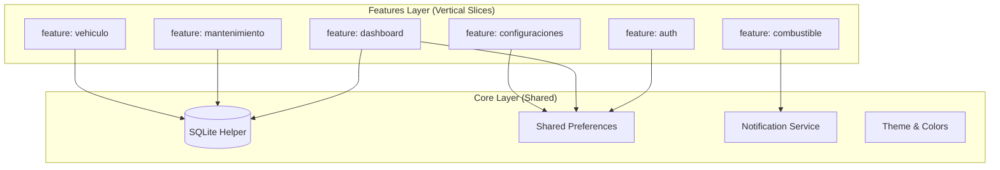

# 🏛️ Documento de Arquitectura y Gobernanza Técnica

## 1. Resumen Ejecutivo
El sistema **Bitácora de Mantenimiento Vehicular** está estructurado bajo los principios de **Vertical Slicing Absoluto** y **Arquitectura Limpia** por módulos. El propósito del diseño es garantizar que cada funcionalidad del negocio (Autenticación, Combustible, Mantenimiento, Vehículo, Dashboard) sea completamente independiente, cohesiva y modular. Si una de las características (slices) es removida, el sistema debe compilar perfectamente sin romper el núcleo ni las demás características.

---

## 2. Estructura de Directorios

El código fuente del proyecto está organizado bajo el siguiente árbol de directorios estricto:

```
lib/
├── core/                    # Elementos compartidos transversalmente (Base de Datos, Configuración, Temas)
│   ├── config/              # Gestión de variables de entorno y preferencias de la app (Moneda)
│   ├── database/            # Helper de base de datos física SQLite local
│   ├── services/            # Servicios de Notificación Push Locales de Alta Prioridad
│   └── theme/               # Diseño y directrices de colores premium
└── features/                # Rebanadas Verticales Autónomas (Modulares)
    ├── auth/                # Dominio de Autenticación
    ├── combustible/         # Dominio de Consumo y Autonomía Predictiva
    ├── configuraciones/     # Módulo de Ajustes Generales
    ├── dashboard/           # Consola de Control de Telemetría
    ├── mantenimiento/       # Módulo de Registro y Edición de Bitácoras
    └── vehiculo/            # Módulo de Estado y Diagnósticos
```

---

## 3. Diagrama de Componentes (Mermaid)

El siguiente diagrama ilustra la relación de acoplamiento débil entre las diferentes rebanadas verticales y el núcleo (`core/`):



---

## 4. Registro de Decisiones de Arquitectura (ADR)

### ADR 001: Consolidación de Vertical Slicing Absoluto
* **Contexto:** Inicialmente el proyecto poseía carpetas globales redundantes (`lib/data`, `lib/domain`, `lib/presentation`) que propiciaban código espagueti y acoplamiento severo.
* **Decisión:** Agrupar y encapsular todas las entidades de dominio, lógica de aplicación (BLoCs) y vistas de infraestructura por módulo de negocio bajo `lib/features/`. Borrar permanentemente las carpetas globales huérfanas.
* **Consecuencias:**
  * **Positivo:** Alta cohesión y bajo acoplamiento. Facilidad de mantenimiento y pruebas aisladas.
  * **Negativo:** Mayor cantidad de carpetas internas duplicadas para dominio e infraestructura en lugar de una única carpeta general.

### ADR 002: Persistencia Física con SQLite y Fallback de Red
* **Contexto:** Se requiere un funcionamiento autónomo sin depender de red o servidores externos que puedan fallar en la carretera (Modo Offline-First).
* **Decisión:** Utilizar SQLite local a través de `sqlite_database_helper.dart` como fuente de verdad inmutable. La sincronización externa de red ocurre en segundo plano a través de mapeadores robustos en la capa de infraestructura.
* **Consecuencias:**
  * **Positivo:** Confiabilidad absoluta bajo cualquier condición de red.
  * **Negativo:** Mayor complejidad al escribir mapeadores de datos manuales para sincronización bidireccional.
